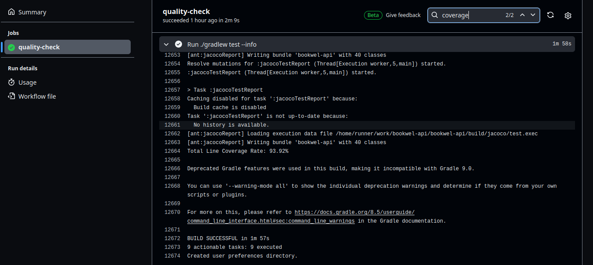

# Bookwel-api :sparkles:
This document outlines the functionalities of the Bookwel API, facilitating interactions with books, categories, users, reactions, and an AI-driven chat system.

__NB__: This api is available at the following URL: https://book-api.preprod.hei.school

## _Prerequistes_ :sparkler:
To launch this API locally, ensure you have the following prerequisites installed:

    JDK - 17
    Postgresql database server 

Additionally, set the following environment variables:

    AWS_ACCESS_KEY_ID
    AWS_REGION
    AWS_S3_BUCKET
    AWS_SECRET_ACCESS_KEY
    BOOK_RECOMMENDATION_API_URL
    FIREBASE_DATA_CONFIG
    OPENAI_API_KEY
    SPRING_DATASOURCE_URL
    SPRING_DATASOURCE_USERNAME

## _Features_ :sparkler: 

Note that some resources are protected. For more details, you can see an overview of the api specification [here](https://petstore.swagger.io/?url=https://raw.githubusercontent.com/Bookwel-Team/bookwel-api/dev/doc/api.yml)

```
* Interactive conversation with the user and chatbot concerning books.
* Retrieve all book categories.
* Fetch books recommended by AI based on user preference.
* Retrieve all books, filtered by author, title, category, user ID, page, and page size.
* Upload a new book with category, file, and cover picture.
* Retrieve a book by its ID.
* Set or unset a reaction on a book.
* Set or unset reactions on categories.
* Get all users.
* Create a new user
* Retrieve an user by ID.
* Update user profile (except for email).
```

## Coverage :collision:

Note that the API is tested and has a comprehensive test coverage, which currently stands at __93.92%__

